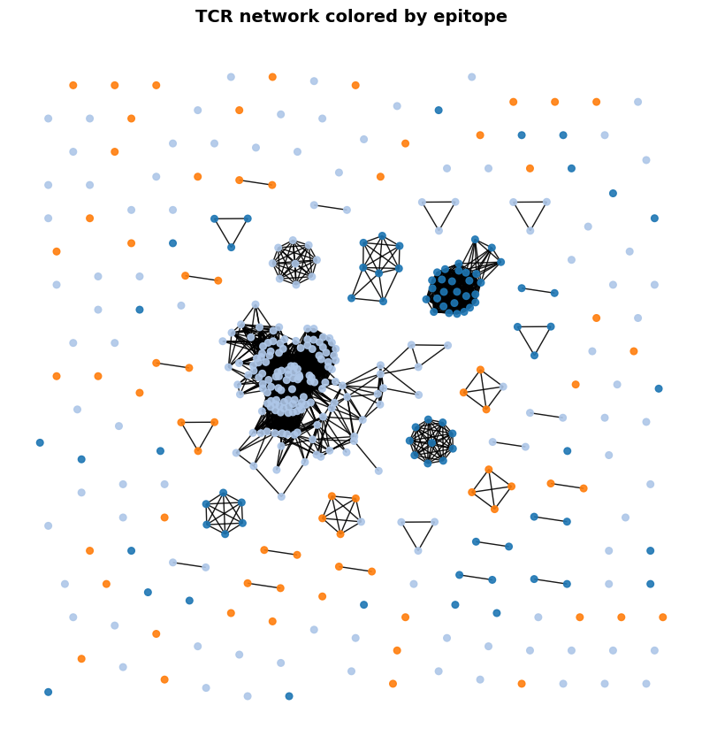

# tcrdistgpu

GPU- and CPU-accelerated pairwise TCRdist computation for T-cell receptor repertoires. Encodes TCR sequences as integer vectors and computes distances via batched matrix lookups, making it practical for large repertoires on both NVIDIA GPUs (CUDA) and standard CPUs. The package also facilitates K-nearest neighbor (KNN) classification of TCRs based on similarity to TCRs with known antigen specificity.

For large datasets, tcrdistgpu can return a sparse matrix retaining only sequence pairs within a maximum TCRdist threshold. This compressed representation keeps memory use tractable at scale and plugs directly into standard clustering algorithms or graph-based analyses of TCR repertoires.

**Current limitation:** human TCR data only.

---

## Install

```bash
pip install git+https://github.com/kmayerb/tcrdistgpu.git
```

Optional GPU backend:

```bash
pip install cupy-cuda12x   # NVIDIA CUDA
```

---

## Quick start

```python
import os, pandas as pd
import tcrdistgpu
from tcrdistgpu.distance import TCRgpu

# Load the bundled example dataset
pkg_data = os.path.join(os.path.dirname(tcrdistgpu.__file__), "data")
data = pd.read_csv(os.path.join(pkg_data, "dash_human.csv"))

tg = TCRgpu(
    mode="cpu",          # "cpu" | "cuda"
    chunk_size=500,      # rows per computation batch
    cdr3b_col="cdr3_b_aa",
    cdr3a_col="cdr3_a_aa",
    vb_col="v_b_gene",
    va_col="v_a_gene",
)

encoding = tg.encode_tcrs(data)          # paired alpha-beta encoding

# Compute index and distance to k nearest neighbors
knn_idx, knn_dist = tg.compute(encoding, encoding, max_k=20)

# Or, compute a full sparse matrix based on max_dist threshold
csr = tg.compute_csr(encoding, encoding, max_dist=90)
```

> ⚠️ **WARNING:** See section on [Preparing your data](#preparing-your-data) before running on your own data.

`knn_idx` is an `(n, max_k)` integer array where each row `i` contains the indices of the `max_k` nearest neighbors of TCR `i`, sorted by increasing distance. `knn_dist` is the same shape and holds the corresponding TCRdist values. For example, `knn_idx[0]` gives the row indices in `data` of the 20 closest TCRs to the first sequence, and `knn_dist[0]` gives their distances.

Default column names are `cdr3b`, `cdr3a`, `vb`, `va`. Pass `*_col` arguments when your data uses different headers.

---

## Quick network plot

The shortest path from sequences to a graph: encode, compute a sparse distance matrix, convert to NetworkX, and plot.

```python
import networkx as nx
from tcrdistgpu.draw_network import draw_network

G = nx.from_scipy_sparse_array(csr)
G.remove_nodes_from(list(nx.isolates(G)))

draw_network(
    G=G,
    data=data,
    color_by="epitope",
    figsize=(10, 10),
    default_size=30,
    show_legend=True,
    title="TCR network colored by epitope",
)
```



---

## Preparing your data

> ⚠️ **WARNING:** Always filter your data before encoding. Rows with unrecognized V gene names or non-standard amino acids will cause encoding to fail or silently produce incorrect distances. Run `filter_tcrs` (defined below) before any call to an encode method.

tcrdistgpu encodes TCRs by looking up each V gene and each amino acid in an internal parameter table. Two things must be true for every row you pass to an encode method:

1. **V gene names are recognized** — the gene must appear in `tg.params_vec` (the internal lookup table). Names should follow IMGT allele notation (e.g. `TRBV9*01`). If your data lacks the `*01` suffix, add it before filtering.
2. **CDR3 sequences are valid** — every character must be one of the 20 standard amino acids and the sequence must be at least 5 residues long.

```python
import numpy as np
import pandas as pd
from tcrdistgpu.distance import TCRgpu

AMINO_ACIDS = set("ACDEFGHIKLMNPQRSTVWY")

def valid_cdr3(cdr3):
    """True iff cdr3 is a string of ≥5 standard amino acids."""
    return isinstance(cdr3, str) and len(cdr3) >= 5 and all(aa in AMINO_ACIDS for aa in cdr3)

def filter_tcrs(df, chain="ab",
                va_col="v_a_gene", vb_col="v_b_gene",
                cdr3a_col="cdr3_a_aa", cdr3b_col="cdr3_b_aa"):
    tg = TCRgpu(mode="cpu", va_col=va_col, vb_col=vb_col,
                cdr3a_col=cdr3a_col, cdr3b_col=cdr3b_col)
    mask = pd.Series(True, index=df.index)
    if "a" in chain:
        mask &= df[va_col].isin(tg.params_vec.keys())
        mask &= df[cdr3a_col].apply(valid_cdr3)
    if "b" in chain:
        mask &= df[vb_col].isin(tg.params_vec.keys())
        mask &= df[cdr3b_col].apply(valid_cdr3)
    dropped = (~mask).sum()
    print(f"Dropped {dropped} of {len(df)} rows ({dropped/len(df):.1%})")
    return df[mask].reset_index(drop=True)

data = filter_tcrs(data, chain="ab")
```

Run `filter_tcrs` once, then pass the returned DataFrame to any encode method. If you are only computing beta-chain distances, pass `chain="b"` and the alpha columns are ignored.

`filter_tcrs` is also available as a method on `TCRgpu`, using the column names already set on the instance:

```python
tg = TCRgpu(mode="cpu", va_col="va", vb_col="vb", cdr3a_col="cdr3a", cdr3b_col="cdr3b")
data_clean = tg.filter_tcrs(data_raw, chain="ab")
```

### Concrete example

`tmp_tcr.tsv` is a larger bundled dataset with columns `va`, `cdr3a`, `vb`, `cdr3b`.

```python
# Load
data_large = pd.read_csv(os.path.join(pkg_data, "tmp_tcr.tsv"), sep="\t")
print(f"Loaded: {len(data_large)} rows")

# Prefilter — pass the column names that match this file
tg = TCRgpu(mode="cpu", va_col="va", cdr3a_col="cdr3a", vb_col="vb", cdr3b_col="cdr3b")

data_large_prefiltered = filter_tcrs(
    data_large,
    chain="ab",
    va_col="va", vb_col="vb",
    cdr3a_col="cdr3a", cdr3b_col="cdr3b",
)
print(f"After filtering: {len(data_large_prefiltered)} rows")

# Encode and compute
encoding = tg.encode_tcrs(data_large_prefiltered)
csr = tg.compute_csr(encoding, encoding, max_dist=100)
```

---

## GPU vs CPU performance

For small datasets (a few hundred TCRs), CPU mode is fast enough. For larger repertoires — thousands to hundreds of thousands of sequences — a CUDA GPU provides a substantial speedup. The example below uses `tmp_tcr.tsv` (the larger bundled dataset) to illustrate the difference.

```python
import time
import os, pandas as pd
import tcrdistgpu
from tcrdistgpu.distance import TCRgpu

pkg_data = os.path.join(os.path.dirname(tcrdistgpu.__file__), "data")
data_large = pd.read_csv(os.path.join(pkg_data, "tmp_tcr.tsv"), sep="\t")
data_large = filter_tcrs(data_large, chain="ab",
                          va_col="va", vb_col="vb",
                          cdr3a_col="cdr3a", cdr3b_col="cdr3b")

# CPU
tg_cpu = TCRgpu(mode="cpu", chunk_size=500,
                va_col="va", vb_col="vb", cdr3a_col="cdr3a", cdr3b_col="cdr3b")
enc = tg_cpu.encode_tcrs(data_large)

t0 = time.time()
csr_cpu = tg_cpu.compute_csr(enc, enc, max_dist=100)
print(f"CPU: {time.time() - t0:.1f}s")

# GPU (CUDA)
tg_gpu = TCRgpu(mode="cuda", chunk_size=500,
                va_col="va", vb_col="vb", cdr3a_col="cdr3a", cdr3b_col="cdr3b")
enc = tg_gpu.encode_tcrs(data_large)

t0 = time.time()
csr_gpu = tg_gpu.compute_csr(enc, enc, max_dist=100)
print(f"GPU: {time.time() - t0:.1f}s")
```

### GPU burn-in

The first CUDA call in a session is slow — the GPU driver initialises, kernels are compiled, and memory is allocated. This one-time overhead can make a short benchmark look deceptively slow. A **burn-in** runs a trivial computation on a tiny encoding first, paying the initialisation cost upfront so that the main computation runs at full GPU speed.

Use the first 10 rows of your data for the burn-in — enough to trigger initialisation without wasting time:

```python
# Burn-in: warm up the GPU with a minimal encoding
enc_burnin = tg_gpu.encode_tcrs(data_large.head(10))
_ = tg_gpu.compute_csr(enc_burnin, enc_burnin, max_dist=100)

# Now time the real computation — GPU is fully initialised
t0 = time.time()
csr_gpu = tg_gpu.compute_csr(enc, enc, max_dist=100)
print(f"GPU (after burn-in): {time.time() - t0:.1f}s")
```

---

## Encoding options

Each encode method returns a 2-D integer numpy array (one row per TCR) that can be passed to any compute method.

```python
data = filter_tcrs(data, chain="ab")
e_full   = tg.encode_tcrs(data)        # paired alpha+beta (Vα, CDR3α, Vβ, CDR3β)
e_beta   = tg.encode_tcrs_b(data)      # beta chain only   (Vβ, CDR3β)
e_alpha  = tg.encode_tcrs_a(data)      # alpha chain only  (Vα, CDR3α)
e_vb     = tg.encode_vb_only(data)     # Vβ gene only
e_va     = tg.encode_va_only(data)     # Vα gene only
e_cdr3b  = tg.encode_cdr3b_only(data)  # CDR3β only
e_cdr3a  = tg.encode_cdr3a_only(data)  # CDR3α only
```

Any encoding can be used with any compute method, allowing single-chain or gene-only distance calculations.

---

## Compute methods

All methods accept two encodings (`encoded1`, `encoded2`), enabling cross-repertoire comparisons. Pass the same encoding twice for within-repertoire distances.

### K nearest neighbors

```python
knn_idx, knn_dist = tg.compute(encoding, encoding, max_k=20)
# knn_idx  : (n, max_k) integer array — indices of nearest neighbors
# knn_dist : (n, max_k) integer array — corresponding distances
```

### Dense distance array

> ⚠️ **WARNING:** `compute_array` stores the full N×M distance matrix in memory. For N=10,000 sequences this is ~200 MB (int16); for N=100,000 it exceeds 20 GB. Use `compute_csr_fast` with a `max_dist` or `max_k` threshold for large datasets.

For small datasets only — holds the full N×M matrix in memory.

```python
arr = tg.compute_array(encoding, encoding)
# arr : (n, m) integer array
```

### CSR sparse matrix

```python
import numpy as np

# Retain k nearest neighbors per row
csr_knn  = tg.compute_csr(encoding, encoding, max_k=10)

# Retain all pairs within a radius (inclusive)
csr_rad  = tg.compute_csr(encoding, encoding, max_dist=100)
```

### Faster CSR: `compute_csr_fast`

For large datasets, prefer `compute_csr_fast`, which calls `compute_csr_experimental` internally and is significantly faster than `compute_csr`.

```python
# Equivalent to compute_csr, but much faster for large N
csr_knn = tg.compute_csr_fast(encoding, encoding, max_k=10)
csr_rad = tg.compute_csr_fast(encoding, encoding, max_dist=100)
```

**Why is it faster?** `compute_csr` builds a `dok_matrix` (a Python dict) and fills it via Python-level inner loops over every nonzero element — one dict insertion per entry. `compute_csr_experimental` (called by `compute_csr_fast`) instead accumulates row/column/value lists using vectorized NumPy operations (`mx.nonzero`, `mx.argpartition`, array reshape/repeat), then constructs a `coo_matrix` in a single call and converts to CSR. This eliminates the Python loop overhead and is dramatically faster for datasets of even a few thousand sequences.

`compute_csr` is kept for backward compatibility.

### Distance distribution (histogram / PMF)

```python
bins = np.arange(0, 401, 12)

# All pairwise distances
all_hist = tg.compute_distribution(encoding, encoding, pmf=False, bins=bins)
all_pmf  = tg.compute_distribution(encoding, encoding, pmf=True,  bins=bins)

# KNN-restricted distributions
knn_hist = tg.compute_distribution(encoding, encoding, max_k=20, pmf=False, bins=bins)
knn_pmf  = tg.compute_distribution(encoding, encoding, max_k=20, pmf=True,  bins=bins)
```

### Convenience wrapper: encode + CSR in one call

```python
csr = tg.tcrdist_csr(data, chain="b", max_k=20)
csr = tg.tcrdist_csr(data, chain="ab", max_dist=100)
```

`chain` accepts `"a"`, `"b"`, or `"ab"`. Pass a second DataFrame as `data2` for cross-repertoire computation.

---

## Cross-repertoire comparison

Pass two different encodings to any compute method:

```python
enc_m1  = tg.encode_tcrs(data.query('epitope == "M1"').reset_index(drop=True))
enc_all = tg.encode_tcrs(data)

knn_idx, knn_dist = tg.compute(enc_m1, enc_all, max_k=20)
csr = tg.compute_csr(enc_m1, enc_all, max_dist=100)
```

---

## KNN classification

`knn_tcr` encodes TCRs, computes distances, and performs distance-weighted KNN classification, returning accuracy and AUC across a range of k values.

```python
from tcrdistgpu.knn import knn_tcr
from sklearn.model_selection import train_test_split

cols = ["cdr3_b_aa", "v_b_gene", "cdr3_a_aa", "v_a_gene", "epitope"]
data = pd.read_csv("data/dash_human.csv")[cols]

y = (data["epitope"] == "M1").astype(int).values
X = data[cols[:-1]]
X_train, X_test, y_train, y_test = train_test_split(X, y, test_size=0.2, random_state=42)

# Beta-chain only
df, probs = knn_tcr(
    tcr_train=X_train, tcr_test=X_test,
    label_train=y_train, label_test=y_test,
    chain="b", mode="cpu",
    kbest=20, krange=range(1, 10),
    adjust_class_weights=True,
    cdr3b_col="cdr3_b_aa", cdr3a_col="cdr3_a_aa",
    vb_col="v_b_gene", va_col="v_a_gene",
)
print(df)

# Paired alpha-beta
df, probs = knn_tcr(
    tcr_train=X_train, tcr_test=X_test,
    label_train=y_train, label_test=y_test,
    chain="ab", mode="cpu",
    kbest=20, krange=range(1, 10),
    adjust_class_weights=True,
    cdr3b_col="cdr3_b_aa", cdr3a_col="cdr3_a_aa",
    vb_col="v_b_gene", va_col="v_a_gene",
)
print(df)
```

`df` columns: `k`, `Accuracy`, `AUC`, `adjust_class_weights`, `mode`.  
`probs` is a list (one entry per k) of (n_test × 2) probability arrays.

### Multi-class KNN (pp65 / M1 / BMLF)

`knn_tcr` internally supports any number of classes for *prediction* (the vote array is sized by `n_unique_classes`), but its probability extraction and AUC reporting are hardcoded for binary labels. For multi-class use, call `TCRgpu.compute()` directly and implement the weighted voting yourself. Labels must be integer-encoded before passing to the vote accumulator.

```python
import numpy as np
import pandas as pd
from sklearn.model_selection import train_test_split
from sklearn.preprocessing import LabelEncoder
from sklearn.utils.class_weight import compute_class_weight
from sklearn.metrics import accuracy_score, roc_auc_score
from tcrdistgpu.distance import TCRgpu

cols = ["cdr3_b_aa", "v_b_gene", "cdr3_a_aa", "v_a_gene", "epitope"]
data_mc = pd.read_csv(os.path.join(pkg_data, "dash_human.csv"))
data_mc = data_mc[data_mc["epitope"].isin(["pp65", "M1", "BMLF"])][cols].reset_index(drop=True)

# Integer-encode epitope labels
le = LabelEncoder()
y = le.fit_transform(data_mc["epitope"])   # 0=BMLF, 1=M1, 2=pp65 (alphabetical)
X = data_mc[cols[:-1]]

X_train, X_test, y_train, y_test = train_test_split(
    X, y, test_size=0.2, random_state=42, stratify=y
)

tg = TCRgpu(
    mode="cpu", chunk_size=200,
    cdr3b_col="cdr3_b_aa", cdr3a_col="cdr3_a_aa",
    vb_col="v_b_gene", va_col="v_a_gene",
)

enc_test  = tg.encode_tcrs(X_test)
enc_train = tg.encode_tcrs(X_train)

k = 10
knn_idx, knn_dist = tg.compute(enc_test, enc_train, max_k=k)

# Class-balanced distance-weighted voting
n_classes = len(le.classes_)
class_weights = compute_class_weight("balanced", classes=np.unique(y_train), y=y_train)
cw = dict(zip(np.unique(y_train), class_weights))

votes = np.zeros((len(X_test), n_classes), dtype="float32")
for i in range(len(X_test)):
    for j in range(k):
        lbl = y_train[knn_idx[i, j]]
        votes[i, lbl] += cw[lbl] / (knn_dist[i, j] + 1e-5)

predictions = np.argmax(votes, axis=1)
probs = votes / votes.sum(axis=1, keepdims=True)

acc  = accuracy_score(y_test, predictions)
mauc = roc_auc_score(y_test, probs, multi_class="ovr", average="macro")

print(f"k={k}  Accuracy={acc:.3f}  Macro-AUC={mauc:.3f}")
print("Classes:", le.classes_)
```

---

## Network visualization

`draw_network` (from `tcrdistgpu.draw_network`) converts a CSR sparse distance matrix into a NetworkX graph and plots it. Nodes can be colored by any categorical or continuous column in your DataFrame. The layout defaults to graphviz `neato` and falls back to `spring` if pygraphviz is not installed.

```bash
pip install networkx matplotlib
pip install pygraphviz   # optional, enables neato/dot/fdp layouts
```

### Build a graph from a CSR matrix

```python
import pandas as pd
import numpy as np
import networkx as nx
from tcrdistgpu.distance import TCRgpu
from tcrdistgpu.draw_network import draw_network

data = pd.read_csv("data/dash_human.csv")

tg = TCRgpu(
    mode="cpu",
    chunk_size=500,
    cdr3b_col="cdr3_b_aa",
    cdr3a_col="cdr3_a_aa",
    vb_col="v_b_gene",
    va_col="v_a_gene",
)

encoding = tg.encode_tcrs(data)

# Build a CSR sparse matrix — retain pairs within TCRdist ≤ 24
csr = tg.compute_csr(encoding, encoding, max_dist=24)

# Convert to NetworkX graph and drop isolated nodes
G = nx.from_scipy_sparse_array(csr)
G.remove_nodes_from(list(nx.isolates(G)))
```

### Categorical coloring (e.g. by epitope)

Nodes are colored by a column in `data`. Any column with ≤ 20 unique values is treated as categorical automatically.

```python
draw_network(
    G=G,
    data=data,
    color_by="epitope",
    figsize=(10, 10),
    default_size=30,
    show_legend=True,
    title="TCR network colored by epitope",
    save_path="tcr_network_epitope.png",
)
```

### Continuous coloring

Pass `color_type='continuous'` to map a numeric column to a colormap.

```python
# Add a numeric column — e.g. CDR3 beta length
data["cdr3b_len"] = data["cdr3_b_aa"].str.len()

draw_network(
    G=G,
    data=data,
    color_by="cdr3b_len",
    color_type="continuous",
    cmap="plasma",
    vmin=10,
    vmax=20,
    figsize=(10, 10),
    default_size=30,
    title="TCR network colored by CDR3β length",
    save_path="tcr_network_cdr3b_len.png",
)
```

### Node sizing

Any numeric column can drive node size via `size_by`. `size_scale` is a linear multiplier; `size_range` clips the result.

```python
import numpy as np

data["random_size"] = np.random.randint(1, 41, size=len(data))

draw_network(
    G=G,
    data=data,
    color_by="epitope",
    size_by="random_size",
    size_scale=5,
    size_range=(5, 200),
    figsize=(10, 10),
    save_path="tcr_network_sized.png",
)
```

---

## Locating package data

```python
import importlib.util, os
spec = importlib.util.find_spec("tcrdistgpu")
pkg_data = os.path.join(os.path.dirname(spec.origin), "data")
print(os.listdir(pkg_data))
```

---

## Credit

Original idea and GPU kernel — Mikhail Pogorelyy (mpogorel@fredhutch.org).  
Python package, CPU/GPU implementation, and extensions — Koshlan Mayer-Blackwell (kmayerbl@fredhutch.org).
